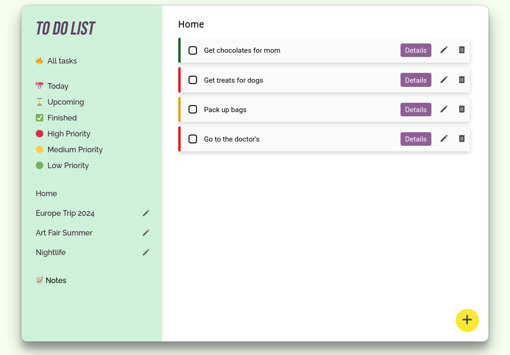

## The Odin Project

# Project: To-do list

[**Live version** of the site can be found here](https://renchester.github.io/top-todo-list/)

This to-do list webapp allows you to take notes, list tasks, and organize these tasks through projects.

Features:

1. _*Home Page*_
   This main panel displays all the tasks listed regardless of their project. Within the task bar are options to display the task details, edit the details, and delete the task entirely.

2. _*Sidebar*_
   The sidebar allows you to filter the tasks either by project, by urgency, or by their due dates. The details of the project are also editable.

3. _*Notes*_
   The notes tab displays all the notes taken. The notes themselves are also editable within each note box.

4. _Authentication and Cloud Storage_
   The app uses Firebase services (authentication and Firestore) to store user data in the cloud.

   The

Add tasks by clicking on the "Add" button (located at the bottom of the main panel). Enter in a description, due date, urgency, and project name. Tasks listed without specific projects will only show up in the default _Home_ panel.

### Technologies Used

- Typescript
- Firebase (Authentication and FirestoreDB)
- HTML5
- CSS

### Getting Started

In order to setup and work on this project on your own, you will need to:

1. Clone this project:  
   `git clone https://github.com/renchester/top-todo-list.git`

2. Once you have cloned this project, you can install the required dependencies by using:  
   `npm install`

3. A live demo of the project can be started by using:  
   `npm start`

4. Distribution files can be produced using:  
   `npm run build`

### Deployed on GitHub Pages

Deployed on [GitHub Pages](https://pages.github.com/)

### Display

---

Developed by **Renchester Ramos**
